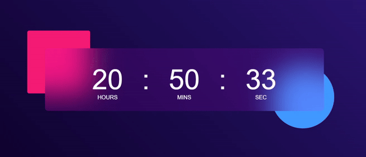

# Digital Clock 🕒

## Overview
The *Digital Clock* is a stylish and minimalistic web application that displays the current time in hours, minutes, and seconds. It features a vibrant gradient background and a modern clock design.

## Technologies Used 🚀
- **HTML**
- **CSS**
- **JavaScript**

## Features 🌟
- Real-time updating of hours, minutes, and seconds.
- Vibrant gradient background for an aesthetically pleasing look.
- Modern clock design with clear visibility.

## Usage 💻
Simply open the `index.html` file in a web browser, and the Digital Clock will start displaying the current time.

## Live Demo 🌐
Check out the live demo: [Digital Clock Demo](https://digital-clock-livid-nu.vercel.app)

## Installation 🛠️
1. Clone the repository: `git clone https://github.com/Eraycann/Digital-Clock`
2. Open the project folder in your code editor.
3. Launch the `index.html` file in a web browser.

## Customization 🎨
- Modify the background gradient in the `style.css` file to suit your preferences.
- Adjust the clock design by updating styles in the `style.css` file.

## Contributing 🤝
Contributions are welcome! Feel free to enhance the design, add new features, or fix any issues. Open a pull request to contribute.

## License 📜
This project is licensed under the [MIT License](LICENSE.md).

## Author ✨
- Eraycan Sivri
- Contact: eraycansivri@hotmail.com

Enjoy the stylish simplicity of the Digital Clock!
